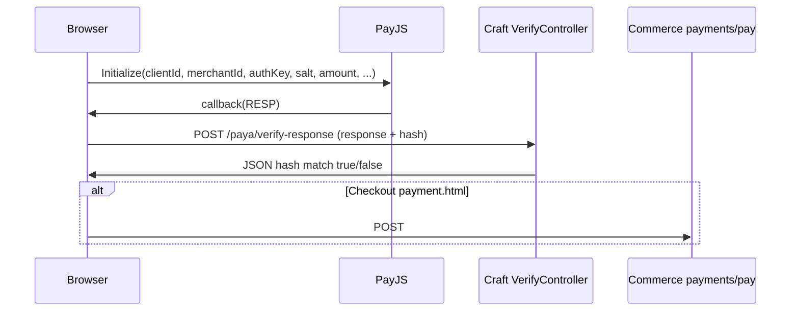

# Paya — functional specification (Payments JS + Craft)

This document describes **exactly** what the Paya plugin and its **related templates** do today. Paya is used as a **client-side Payments JS (Sage/Paya hosted JS)** flow with **server-side HMAC verification** of the gateway response hash. Treat this as **payment-critical**: any migration must preserve routing, crypto behavior, Commerce “pay” handoff, and secrets handling (or replace them deliberately).

---

## Purpose

1. Expose **`craft.paya`** Twig variables to build **PayJS** `Initialize()` parameters: **auth key** (AES-256-CBC payload) and **nonces** (salt / IV).
2. Provide an **anonymous HTTP endpoint** that accepts a POSTed JSON payload (`response` + `hash`) and checks the hash with **HMAC-SHA512** against the **developer key** (same secret used in the Twig encryption path).

The plugin **does not** implement a `craft\commerce\base\Gateway` class. **Commerce** is integrated entirely in **templates** (checkout pay form + gateway ID) plus PayJS.

---

## Dependencies

| Dependency | Notes |
|------------|--------|
| **Craft CMS** | Plugin base, routing, Twig variable, controller. |
| **Craft Commerce** | **Not declared** in plugin `composer.json`, but **required in practice**: checkout uses `commerce/payments/pay`, `cart.gatewayId`, gateways, etc. |
| **jQuery + PayJS** | Loaded from `https://www.sagepayments.net/pay/1.0.2/js/pay.min.js` (see `templates/patients/order/invoice.html`; checkout template uses PayJS in page JS). |
| **openssl + hash_pbkdf2** | Used in `PayaVariable::getAuthKey()` / `getNonces()`. |

---

## Plugin metadata

| Item | Value |
|------|--------|
| Handle | `paya` |
| Class | `neuroscience\paya\Paya` |
| `hasCpSettings` / `hasCpSection` | `false` |
| Schema version | `1.0.0` (no migrations) |

---

## Architecture overview



- **Card data** is tokenized/handled by PayJS (not posted raw to your server in the documented flow).
- **Order completion** on checkout still goes through **`commerce/payments/pay`** via `#paymentForm` after client-side “approved” + successful hash AJAX (see integration details below).

---

## `Paya` (`src/Paya.php`)

### Site URL rules

```php
$event->rules['siteActionTrigger1'] = 'paya/verify';
```

```php
$event->rules['cpActionTrigger1'] = 'paya/verify/do-something';
```

**Risk / cleanup:** Keys `siteActionTrigger1` and `cpActionTrigger1` look like **scaffold placeholders**, not real URL paths. Front-end code posts to **`/paya/verify-response`** and **`/paya/verifyResponse`** (see below). Those paths are **not** defined here.

- **Likely** production relies on **web server rewrites**, **other Craft routes** (CP or project config), or **default Craft action URLs** — this must be **verified in each environment**.
- **Migration:** Replace with explicit rules, e.g. `'paya/verify-response' => 'paya/verify/verify-response'`, and match what nginx/apache expects.

### Twig variable

Registers `craft.paya` → `PayaVariable::class`.

### Other

- Empty install handler; info log only.

---

## `PayaVariable` (`src/variables/PayaVariable.php`)

### `getNonces()`

- Generates **16-byte IV** via `openssl_random_pseudo_bytes(16)`.
- Returns `['iv' => $iv, 'salt' => base64_encode(bin2hex($iv))]` (salt is derived from IV; note **`bin2hex` then `base64_encode`** — preserve exactly if PayJS/auth must stay compatible).

### `getAuthKey($toBeHashed, $password, $salt, $iv)`

- **Key material:** `hash_pbkdf2('sha1', $password, $salt, 1500, 32, true)` (32 bytes, binary).
- **Cipher:** `openssl_encrypt($toBeHashed, 'aes-256-cbc', $encryptHash, 0, $iv)`.
- `$password` in templates is the **developer KEY** string; `$toBeHashed` is typically JSON for the PayJS request object.

### `vars()`

Returns a PHP array used by Twig as `craft.paya.vars`:

| Key | Role |
|-----|------|
| `req` | `merchantId`, `merchantKey`, `requestType` (`payment`), **`orderNumber`** (`"Invoice" . rand(0, 1000)`), `amount` (`1.00` in source — **templates override amount** from cart/order), `preAuth` |
| Nested `merchant` / `merchantTest` | IDs/keys (duplicate of values embedded under `req` / test blocks) |
| `dev` | **Production “developer” (Payments JS) `ID` + `KEY`** — used as `clientId` / encryption password in templates |
| `sandbox` | **Sandbox developer `ID` + `KEY`** |
| `request` | `environment`, sample `amount`, `preAuth` |

**CRITICAL — secrets in source:** Production and sandbox **merchant IDs**, **merchant keys**, and **developer keys** are **hardcoded** in this file. The **same developer KEY** (`rrvHwB3EensEuAFC`) is also **hardcoded** in `VerifyController` for HMAC verification (see below). **Rotation, env vars, and `.gitignore`/secrets scanning** should be part of any serious hardening; for migration, **document parity** (same keys in PHP + templates) until you externalize config.

**CRITICAL — order reference:** `vars()['req']['orderNumber']` is a **random** `Invoice{0..1000}`. Checkout `payment.html` passes **`req.orderNumber`** into PayJS for both cert and prod branches (not `cart.number` / order reference). **Reconciliation** between Paya transaction metadata and Commerce orders may depend on other fields; assume **orderNumber in gateway ≠ Commerce order number** unless you change templates.

---

## `VerifyController` (`src/controllers/VerifyController.php`)

| Setting | Value | Payment / security note |
|---------|--------|-------------------------|
| `$enableCsrfValidation` | `false` | **Entire controller** skips CSRF. The AJAX call from checkout **does** send `CRAFT_CSRF_TOKEN` in serialized `#verifyForm`, but the controller does not require validation. **Risk:** CSRF off + anonymous actions increases abuse surface (e.g. hash oracle / probing). Often done so third parties can post — here the caller is **first-party JS**. Revisit for Craft 4. |
| `$allowAnonymous` | `['index', 'do-something', 'verify-response']` | Public endpoints without login. |

### `actionVerifyResponse()` (routed as **`verify-response`**)

- Expects **`$_POST['response']`** — string containing JSON.
- Decodes JSON; expects object with **`response`** (API response object) and **`hash`** (base64 HMAC from PayJS).
- Computes:  
  `$calcHash = base64_encode(hash_hmac('sha512', json_encode($respObj->response), 'rrvHwB3EensEuAFC', true));`
- Compares **`$hash === $calcHash`** → JSON body includes `Hash Match` → **`true` / `false` / `empty`** (if POST missing).
- Returns `$this->asJson([$response])` (extra array wrapper).

**CRITICAL:** HMAC secret is **hardcoded** and must stay **identical** to the **developer KEY** used for `getAuthKey` in Twig/PayJS for verification to pass.

### `actionIndex()`

Returns a plain string stub (“Welcome to…”). **Operational noise** if exposed.

### `do-something`

**Risk:** Listed in `$allowAnonymous` but **no** `actionDoSomething()` exists → **404 or invalid action** if hit.

---

## Commerce + template integration (not inside the plugin)

These behaviors are **required** for a full “what Paya does on this site” picture.

### Checkout — `templates/shop/checkout/payment.html` (and backup `payment-09-11-2022.html`)

- When **`cart.gatewayId == '9'`**, renders PayJS UI (`#paymentDiv`), `#verifyForm`, and script.
- **Environment switch:** `craft.app.request.serverName` in `local.ns` / `local.neuroscience` → sandbox `clientId`/keys, `environment: cert`, debug-style UI; else production `liveKeys`, `environment: prod`, `postbackUrl` production site.
- **Amount:** `cart.totalPrice` (formatted), not `vars().req.amount`.
- **AJAX:** `POST` **`/paya/verify-response`** with serialized `#verifyForm` (includes `action` hidden + CSRF + `response`).
- On **`.done`**, if PayJS says approved and status `Approved`, shows success UI and **`$('#paymentForm').submit()`** — that is the normal Commerce form posting **`commerce/payments/pay`** with `gatewayId` and **`cart.gateway.getPaymentFormHtml(params)`** for non-PayPal gateways.

**Implication:** Gateway **ID 9** in the database must match whatever Commerce expects for “pay” after PayJS (often a **manual or thin custom gateway** that completes without browser card fields). **Confirm** gateway type in Commerce CP when migrating.

### Patient invoice — `templates/patients/order/invoice.html`

- Different PayJS init: **`order.id`** as `orderNumber` in one place, **`addFakeData: true`** in snippet, **`environment: "prod"`** only (no local split shown in excerpt).
- **Inconsistency:** Hidden `action` is **`/paya/verify/verifyResponse`** (camelCase) but AJAX **`url: '/paya/verifyResponse'`** — checkout uses **kebab-case** **`verify-response`**. **Risk:** one path may **404** depending on Craft URL normalization; **standardize** routes and JS URLs during migration.
- Callback order: may **`$('#paymentForm').submit()`** before verification AJAX (verify runs **after** submit in code order).

---

## Operational checklist (pre/post migration)

- [ ] **Routes:** Confirm how `/paya/verify-response` and `/paya/verifyResponse` resolve to `paya/verify/verify-response`; fix `siteActionTrigger1` placeholder rules.
- [ ] **Gateway 9:** Document name, class, and whether `getPaymentFormHtml` is empty for Paya; test full `commerce/payments/pay` after PayJS approval.
- [ ] **Secrets:** Move keys out of repo; align VerifyController HMAC secret with developer KEY env.
- [ ] **CSRF / anonymous:** Decide if `enableCsrfValidation` can be true for `actionVerifyResponse` only; restrict `$allowAnonymous` to required actions; remove or implement `do-something`.
- [ ] **orderNumber:** Decide if Paya should receive `cart.number`, `cart.shortNumber`, or store reference for support.
- [ ] **invoice vs checkout:** Unify verification URL and action name; retest recurring / invoice PayJS options.
- [ ] **PayJS script URL / API version:** Confirm `pay.min.js` 1.0.2 still supported by processor.

---

## Files

| Path | Role |
|------|------|
| `src/Paya.php` | URL rules (currently placeholder keys), Twig registration |
| `src/variables/PayaVariable.php` | Nonces, AES auth key, **hardcoded** merchant/dev keys, `req` payload |
| `src/controllers/VerifyController.php` | **HMAC verify** endpoint; **hardcoded** key; CSRF off |
| `src/translations/en/paya.php` | Log string |

---

## Version history (documentation)

| Date | Notes |
|------|--------|
| 2026-04-07 | Spec from plugin + checkout/invoice templates; emphasizes gateway, routing, and secrets. |
